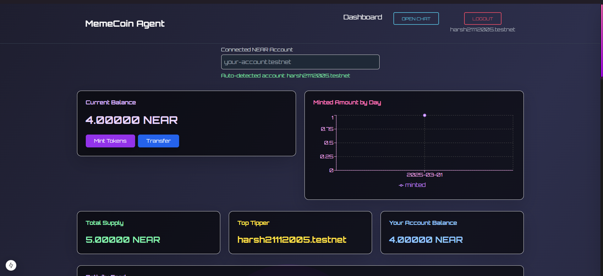
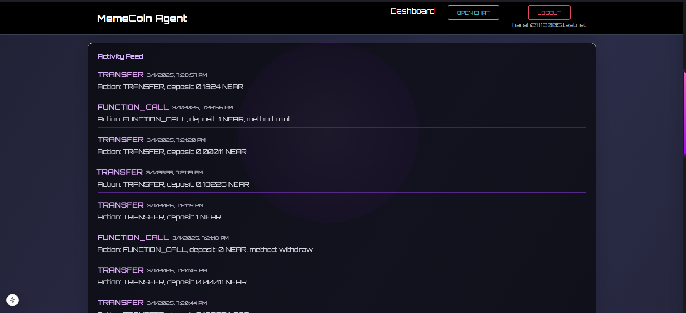
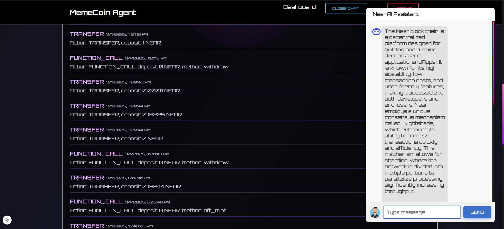

# 🎉 Memecoin-Agent: NEAR Blockchain Telegram & Web App 🚀

Memecoin-Agent is a **Telegram Bot** and **Web Application** built on the **NEAR Blockchain** that allows users to interact with smart contracts seamlessly. Users can perform various blockchain transactions through the Telegram bot, while a frontend interface provides analytics such as balance, activity history, and an integrated AI chatbot for blockchain interactions.

---


## 🌟 Features

### 🔗 1. NEAR Blockchain Integration
- **Smart Contract Interactions:** Users can execute various NEAR transactions via the bot.
- **Analytics Dashboard:** View real-time balance, transaction history, and analytics on the frontend.
- **AI Chatbot:** Integrated chatbot in the frontend that interacts with the NEAR blockchain.

### 🤖 2. Telegram Bot Functionalities
- `/mint <amount>` - Mint Memecoin tokens.
- `/balance <account>` - Check the token balance of an account.
- `/activity <account>` - Fetch transaction history.
- `/tip <receiver> <amount>` - Transfer tokens (tip) to another user.
- `/withdraw <amount>` - Withdraw tokens to a NEAR wallet.
- `/burn <amount>` - Burn tokens from balance.
- `/stake <amount>` - Stake tokens.
- `/unstake <amount>` - Unstake tokens.
- `/claim_rewards` - Claim staking rewards.
- `/register_referral <referrer>` - Register a referral account.
- `/setContract <contractId>` - Switch NEAR smart contract dynamically.

For full details on the Telegram Bot, refer to the [Telegram Bot README](./Near_Telegram_Bot.md).

### 🖥️ 3. Frontend Dashboard
- **Balance Tracking:** View real-time balance and transactions.
- **Activity History:** Log of all interactions with the NEAR blockchain.
- **AI Chatbot:** Users can query the chatbot for blockchain-related questions and interact with smart contracts.

### 🤖 4. AI Chatbot
- The frontend chatbot interacts with the NEAR blockchain for transactions and queries.
- Located in the `backend/ai/` folder, handling chatbot logic for both the frontend and Telegram bot.

---

## 🎨 Project Application UI

| **Dashboard** | **Activity Log** | **Chatbot** |
|--------------|-----------------|------------|
|  |  |  |

---

## 📂 Project Structure

```
memecoin-agent/
│── backend/
│   │── ai/                  # AI logic for chatbot (frontend + Telegram bot)
│   │── dist/                # Compiled backend code
│   │── node_modules/        # Backend dependencies
│   │── src/                 # Source code for backend logic
│   │── .env                 # Backend environment variables
│   │── package.json         # Backend dependencies and scripts
│   │── package-lock.json    # Dependency lock file
│   │── tsconfig.json        # TypeScript configuration
│
│── client/
│   │── .next/               # Next.js build output
│   │── app/                 # Application logic (pages, components)
│   │── components/          # UI components
│   │── config/              # Configuration files
│   │── lib/                 # Utilities and helper functions
│   │── node_modules/        # Frontend dependencies
│   │── public/              # Static assets
│   │── .env                 # Frontend environment variables
│   │── .gitignore           # Git ignore file
│   │── components.json      # Component definitions
│   │── eslint.config.mjs    # ESLint configuration
│   │── next-env.d.ts        # Next.js TypeScript environment
│   │── next.config.ts       # Next.js configuration
│   │── package.json         # Frontend dependencies and scripts
│   │── package-lock.json    # Dependency lock file
│   │── postcss.config.mjs   # PostCSS configuration
│   │── README.md            # Project documentation
│   │── tailwind.config.ts   # Tailwind CSS configuration
│   │── tsconfig.json        # TypeScript configuration
```

---

## 🔧 Installation

### 1️⃣ Clone the Repository
```bash
git clone https://github.com/YourRepo/memecoin-agent.git
cd memecoin-agent
```

### 2️⃣ Install Dependencies
```bash
cd backend && npm install  # Install backend dependencies
cd client && npm install  # Install frontend dependencies
```

### 3️⃣ Configure Environment Variables
Create `.env` files in the respective directories:

#### Backend `.env`
```ini
TELEGRAM_BOT_TOKEN=7879958230:AAEnXWEVj9zfMdJOVSphXah2svHfxh99I2k
NEAR_ACCOUNT_ID="XYZ.testnet"
NEAR_ACCOUNT_PRIVATE_KEY=
NEAR_CONTRACT_NAME=harsh21112005.testnet
HF_API_TOKEN = "Hugging face token"
PORT=3000 
OPENAI_API_KEY = "Openai api token"
```

#### AI Chatbot `.env` (Located in `backend/ai/.env`)
```ini
DEBUG=False
# Path to the config file for the model, agent etc
GENERAL_CONFIG_PATH=config/general.yaml
# -- APIS --
OPENAI_API_KEY="Openai Api token"

# Near
NEAR_ACCOUNT_ID="XYZ.testnet"
NEAR_ACCOUNT_PRIVATE_KEY=
NEAR_RPC_URL="https://rpc.testnet.pagoda.co"
```

### 4️⃣ Running the Backend Chatbot
```bash
cd ai
python -m venv venv #Create  Python Virtual environmnet
venv/scripts/activate #For Windows to activate pyhton environment
source venv/bin/activate #For Linux to activate pyhton environment
pip install -r requirements.txt
python src/main.py
```

### 5️⃣ Running the Frontend
```bash
cd client
npm run dev
```


🔴 **[Read the Full Telegram Bot Setup Guide]([Telegram Bot README](./Near_Telegram_Bot.md).)** 🔴  

---

## 🚀 Usage

### 🎯 Telegram Bot
Start a chat with the bot on Telegram and use commands:
```bash
/mint 10000000000000000  # Mint 0.01 NEAR tokens
/balance myaccount.testnet  # Check balance
/activity myaccount.testnet  # View transaction history
```

### 🌍 Web Dashboard
1. Open the frontend in your browser.
2. Log in with your NEAR wallet.
3. View balance, transaction history, and interact with the AI chatbot.

---

## 🤝 Collaboration
For collaboration guidelines, refer to [COLLABORATION.md](./COLLABORATION.md).

---

## 📜 License
MIT

---

## 🛠️ Contributing
Feel free to open issues or PRs for bug fixes, improvements, or new features.

🌟 **Enjoy building with Memecoin-Agent!** 🚀
